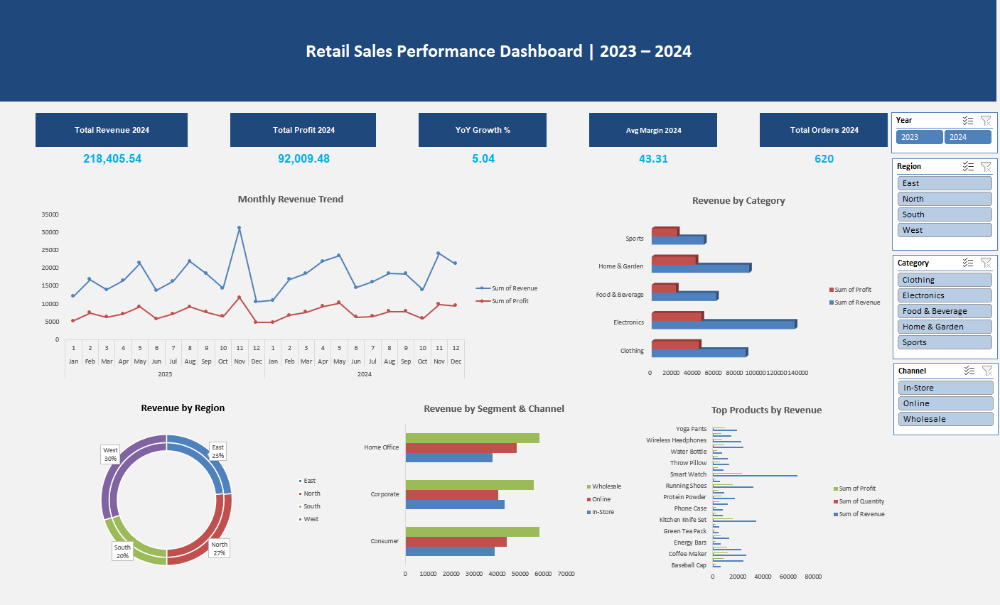

# Retail Sales Performance Dashboard

## Overview
Interactive Excel dashboard analyzing 1,200 retail transactions across 2023–2024.

## Key Results
- Total Revenue 2024: $218,405.54
- YoY Growth: +5.04%
- Avg Profit Margin: 43.31%
- Total Orders: 620

## Tools Used
Excel | Pivot Tables | PivotCharts | Slicers | Python

## Files
- `RetailSales_Portfolio.xlsx` — Main dashboard
- `README_Project.docx` — Full project write-up
